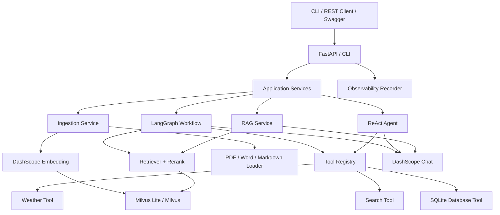
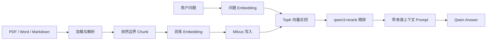
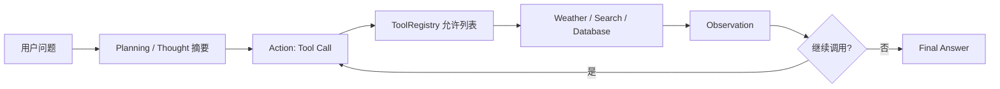
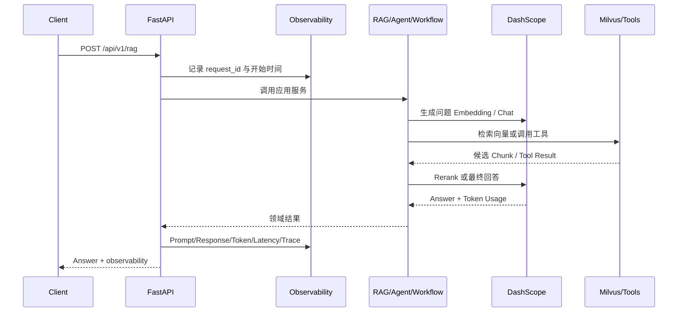

# 企业级 AI 知识助手

一个面向企业知识检索与智能问答场景的 AI Agent 项目。项目以阿里云百炼大模型为默认模型服务，围绕 Prompt Engineering、RAG、Tool Calling、ReAct Agent、LangGraph 工作流和可观测性构建，并采用可替换的接口设计支持后续生产化演进。

> 当前进度：Phase 11 — 项目交付材料、容器化与面试材料已完成

## 快速开始

项目要求 Python 3.11—3.13，并使用 uv 管理依赖：

```bash
cp .env.example .env
uv sync --all-groups
uv run ai-assistant
```

不配置 API Key 时，可运行本地健康检查：

```bash
uv run ai-assistant
# 或
uv run ai-assistant health
```

调用百炼前，在 `.env` 中填写从阿里云百炼控制台获取的
`DASHSCOPE_API_KEY`。普通聊天与增量流式聊天分别运行：

```bash
uv run ai-assistant chat "用三句话介绍 RAG"
uv run ai-assistant chat "用三句话介绍 RAG" --stream
```

运行结构化客服分类 Prompt，或只在本地检查最终消息而不调用模型：

```bash
uv run ai-assistant prompt "已经付款，但退款三天还没到账。"
uv run ai-assistant prompt "已经付款，但退款三天还没到账。" --debug
```

生成一段或多段文本的 Embedding。传入两段文本时，Demo 还会计算余弦相似度：

```bash
uv run ai-assistant embed "企业知识库" "公司内部文档检索"
```

运行 Milvus Lite 的建表、插入、过滤搜索和删除 Demo：

```bash
uv run ai-assistant vector-demo "如何用向量数据库检索企业文档？"
```

Demo 写入的记录使用唯一 ID，并在搜索结束后按 ID 精确删除；Collection 和本地
数据库文件会保留，方便验证持久化与后续阶段复用。

摄取 PDF、Word 或 Markdown 文档，再基于已入库的知识进行问答：

```bash
uv run ai-assistant ingest docs/employee-handbook.pdf
uv run ai-assistant rag "员工年假如何申请？"
```

摄取同一路径的新版文档时，会以稳定的 `document_id` 替换其旧 Chunk，避免重复
召回。PDF 当前支持包含文本层的文件；扫描件需要先经过 OCR。

查看工具的 JSON Schema，并通过 Registry 调用 Weather、Search 或 Database：

```bash
uv run ai-assistant tools
uv run ai-assistant tool weather '{"location":"北京","forecast_days":3}'
uv run ai-assistant tool search '{"query":"AI Agent 最新工程实践","max_results":5}'
uv run ai-assistant tool database \
  '{"query":"SELECT id, name FROM employees WHERE department = ?","parameters":["研发"]}'
```

Search 需要在 `.env` 配置 `TAVILY_API_KEY`；Database 只读取
`DATABASE_PATH` 指向的现有 SQLite 文件，不会自动创建数据库。

运行 ReAct Agent。传入多个问题时，它们在同一进程内共享短期 Memory：

```bash
uv run ai-assistant agent "请查询北京当前天气，并判断是否适合散步。"
uv run ai-assistant agent "北京天气怎么样？" "刚才的温度是多少？"
```

CLI 会按顺序打印 `Thought`、`Action`、`Observation` 和 `Final Answer`。
这里的 Thought 是可公开审计的决策摘要，不是模型隐藏思维链。

运行 LangGraph 工作流。基础版按 Planner、Retriever、Tool、Reviewer、Answer
顺序执行；进阶版按 Supervisor、Research Agent、Tool Agent、Summary Agent
执行：

```bash
uv run ai-assistant workflow basic "员工年假如何申请？"
uv run ai-assistant workflow advanced "请查询北京天气，并结合员工手册给出出行建议。"
```

CLI 会打印 `Checkpoint`、每个 `Node` 的摘要和 `Final Answer`。Checkpoint
使用 LangGraph 内存 Checkpointer 和 thread_id 记录单次图状态；生产环境可替换
为 Postgres 或 SQLite Checkpointer。

启动 FastAPI 服务并打开 Swagger：

```bash
uv run ai-assistant serve
# 浏览器访问 http://127.0.0.1:8000/docs
```

核心 REST API：

```bash
curl http://127.0.0.1:8000/health

curl -X POST http://127.0.0.1:8000/api/v1/chat \
  -H 'Content-Type: application/json' \
  -d '{"message":"用三句话介绍 RAG"}'

curl -X POST http://127.0.0.1:8000/api/v1/rag \
  -H 'Content-Type: application/json' \
  -d '{"question":"员工年假如何申请？"}'

curl -X POST http://127.0.0.1:8000/api/v1/agent \
  -H 'Content-Type: application/json' \
  -d '{"question":"请查询北京天气，并判断是否适合散步。"}'

curl -X POST http://127.0.0.1:8000/api/v1/workflow \
  -H 'Content-Type: application/json' \
  -d '{"mode":"basic","question":"员工年假如何申请？"}'
```

每个 AI 端点都会返回 `observability` 字段，包含 `request_id`、`latency_ms`、
`token_usage` 和安全的 `tool_trace` 摘要。服务端同时输出结构化日志，记录
Prompt/Response 预览、Token Usage、Tool Trace、Error 和 Latency。

使用 Docker Compose 启动服务：

```bash
cp .env.example .env
docker compose up --build
```

详细部署说明见 [docs/deployment.md](docs/deployment.md)，简历与面试材料见
[docs/project-summary.md](docs/project-summary.md)。

常用质量检查命令：

```bash
uv run ruff check .
uv run black --check .
uv run pytest
```

配置优先从环境变量读取，本地可通过 `.env` 覆盖。`.env` 已被 Git 忽略，
可提交的变量示例位于 `.env.example`。

### LLM 配置

| 环境变量 | 默认值 | 说明 |
| --- | --- | --- |
| `DASHSCOPE_API_KEY` | 无 | 百炼 API Key，聊天调用必填 |
| `DASHSCOPE_BASE_URL` | `https://dashscope.aliyuncs.com/compatible-mode/v1` | 百炼 OpenAI-compatible API 地址 |
| `DASHSCOPE_CHAT_MODEL` | `qwen-plus` | 默认聊天模型；兼容已有的 `DASHSCOPE_MODEL` |
| `DASHSCOPE_EMBEDDING_MODEL` | `text-embedding-v3` | 默认文本向量模型 |
| `DASHSCOPE_EMBEDDING_DIMENSIONS` | `1024` | 输出向量维度 |
| `DASHSCOPE_RERANK_URL` | `https://dashscope.aliyuncs.com/compatible-api/v1/reranks` | 百炼文本重排地址 |
| `DASHSCOPE_RERANK_MODEL` | `qwen3-rerank` | 默认重排模型 |
| `DASHSCOPE_TIMEOUT_SECONDS` | `30` | 单次请求超时秒数 |
| `DASHSCOPE_MAX_RETRIES` | `2` | 首次调用之外的最大重试次数 |
| `MILVUS_URI` | `milvus/knowledge.db` | Lite 文件路径或远端 Milvus URI |
| `MILVUS_TOKEN` | 无 | 远端 Milvus/Zilliz Cloud 凭据 |
| `MILVUS_COLLECTION_NAME` | `knowledge_chunks` | 文档 Chunk Collection |
| `MILVUS_TIMEOUT_SECONDS` | `30` | Milvus 操作超时秒数 |

### RAG 配置

| 环境变量 | 默认值 | 说明 |
| --- | --- | --- |
| `RAG_CHUNK_SIZE` | `800` | 单个 Chunk 的目标字符数 |
| `RAG_CHUNK_OVERLAP` | `120` | 相邻 Chunk 的重叠字符数 |
| `RAG_EMBEDDING_BATCH_SIZE` | `10` | 每批 Embedding 文本数 |
| `RAG_INSERT_BATCH_SIZE` | `100` | 每批写入 Milvus 的记录数 |
| `RAG_INITIAL_TOP_K` | `20` | 向量召回候选数 |
| `RAG_FINAL_TOP_K` | `5` | Rerank 后保留的上下文数 |
| `RAG_MAX_CONTEXT_CHARS` | `8000` | 交给 LLM 的上下文字符上限 |
| `RAG_MAX_ANSWER_TOKENS` | `1200` | 回答最大 Token 数 |
| `RAG_MAX_FILE_SIZE_MB` | `20` | 单个摄取文件大小上限 |

### Tool 配置

| 环境变量 | 默认值 | 说明 |
| --- | --- | --- |
| `TAVILY_API_KEY` | 无 | Tavily Search API Key |
| `TOOL_HTTP_TIMEOUT_SECONDS` | `10` | Weather/Search 单次 HTTP 超时秒数 |
| `TOOL_MAX_RETRIES` | `2` | 可重试 HTTP 错误的最大额外尝试次数 |
| `SEARCH_MAX_CONTENT_CHARS` | `1500` | 每条搜索摘要的字符上限 |
| `DATABASE_PATH` | `data/assistant.db` | 只读 SQLite 数据库文件 |
| `DATABASE_MAX_ROWS` | `100` | 单次查询最大返回行数 |
| `DATABASE_TIMEOUT_SECONDS` | `5` | SQLite 锁等待超时秒数 |

### Agent 配置

| 环境变量 | 默认值 | 说明 |
| --- | --- | --- |
| `AGENT_MAX_TOOL_CALLS` | `5` | 单轮最大工具调用数，防止无限循环 |
| `AGENT_MEMORY_TURNS` | `6` | 进程内保留的最近完整问答轮数 |
| `AGENT_MEMORY_MAX_CHARS` | `12000` | Memory 总字符上限 |
| `AGENT_MAX_OBSERVATION_CHARS` | `6000` | 单次回填模型的工具结果上限 |
| `AGENT_MAX_ANSWER_TOKENS` | `1200` | Agent 单次模型输出 Token 上限 |

### LangGraph Workflow 配置

| 环境变量 | 默认值 | 说明 |
| --- | --- | --- |
| `WORKFLOW_RETRIEVAL_TOP_K` | `5` | LangGraph Retriever 节点召回数量 |
| `WORKFLOW_MAX_ANSWER_TOKENS` | `1200` | Answer/Summary 节点最大输出 Token 数 |

### API 与可观测性配置

| 环境变量 | 默认值 | 说明 |
| --- | --- | --- |
| `API_HOST` | `127.0.0.1` | FastAPI 服务监听地址 |
| `API_PORT` | `8000` | FastAPI 服务监听端口 |
| `OBSERVABILITY_PREVIEW_CHARS` | `800` | 日志中 Prompt/Response 预览字符上限 |

## 项目目标

本项目不是一次性 Demo，而是一个可测试、可维护、可扩展的企业级 AI 应用工程，主要目标包括：

- 支持 PDF、Word、Markdown 企业文档的摄取与解析。
- 构建基于阿里百炼 Embedding、Milvus Lite、Retriever 和 Rerank 的完整 RAG 链路。
- 实现 Weather、Search、Database 等工具及统一工具注册机制。
- 实现带 Memory、Planning 和 Tool Calling 的 ReAct Agent。
- 使用 LangGraph 编排 Planner、Retriever、Tool、Reviewer、Answer 工作流。
- 记录 Prompt、Response、Token Usage、Tool Trace、Latency 和 Error Log。
- 通过 FastAPI 提供标准 REST API 与 Swagger 文档。
- 使用抽象接口隔离模型、Embedding、向量数据库和外部工具供应商。

## 功能范围

### Prompt Engineering

- System Prompt 与 Prompt Template
- Few-shot 示例
- 结构化 JSON 输出
- Output Parser
- Prompt 版本管理与调试

### RAG

```text
文档加载 → 文档解析 → Chunk → Embedding → Milvus
       → Retriever → Rerank → LLM → Answer
```

### Agent 与工作流

```text
用户问题
   ↓
Planner → Retriever → Tool → Reviewer → Answer
```

进阶版本将演进为 Supervisor、Research Agent、Tool Agent 和 Summary Agent 组成的多 Agent 协作流程。

### 可观测性

- 请求链路 ID
- Prompt 与模型响应日志
- 工具调用轨迹
- 端到端与节点级耗时
- Token 用量
- 异常与重试日志

## 非功能性要求

- 高内聚、低耦合，遵循 SOLID 和 Clean Architecture 思想。
- 所有公共类和函数包含类型注解与 Docstring。
- 业务模块具有单元测试，关键链路具有集成测试。
- 使用 Ruff、Black 和 pytest 保证代码质量。
- 密钥只从环境变量读取，不进入版本控制。
- 外部依赖通过适配器封装，便于替换和测试。
- 本地开发使用 Milvus Lite，生产环境可迁移至 Milvus Standalone、Distributed 或 Zilliz Cloud。

## 技术选型

| 领域 | 技术 | 选择原因 |
| --- | --- | --- |
| 语言 | Python 3.11+ | AI 生态成熟，适合模型、RAG 与 Agent 工程 |
| 依赖管理 | uv + pyproject.toml | 解析和安装速度快，统一环境与项目元数据 |
| 配置 | pydantic-settings | 类型安全、环境变量校验、适合分环境配置 |
| LLM | 阿里云百炼 DashScope | 满足项目约束，支持通义千问及流式输出 |
| Embedding | 百炼 Embedding | 中文语义能力与模型服务保持一致 |
| 向量数据库 | Milvus Lite | 本地零服务依赖，并保持向生产 Milvus 的迁移路径 |
| RAG 编排 | LangChain 组件 | 提供文档与模型生态适配，但核心业务保留自有抽象 |
| Agent 工作流 | LangGraph | 显式状态、节点和条件边，适合复杂流程与可恢复执行 |
| API | FastAPI | 类型驱动、异步友好、自动生成 OpenAPI/Swagger |
| 重试 | tenacity | 声明式退避与重试策略 |
| 测试 | pytest | Python 工程事实标准，插件生态完整 |
| 质量 | Ruff + Black | 快速静态检查与一致格式化 |
| 可观测性 | structlog + 自定义 Trace | 结构化日志便于检索，并可平滑接入 OpenTelemetry |

### 框架使用边界

- LangChain 用于复用成熟的文档和模型生态能力，不让领域逻辑直接依赖其具体实现。
- LangGraph 用于有状态、可分支、可检查点的 Agent 工作流；普通线性流程保持为简单 Python 服务。
- 不引入 LlamaIndex，避免在同一阶段叠加功能重合的 RAG 框架和认知成本。

### LLM 抽象边界

应用层只依赖自有 `ChatModel` 协议及 `ChatMessage`、`ChatResponse`、
`ChatChunk` 等领域模型。`DashScopeChatModel` 是基础设施适配器，OpenAI SDK
仅用于调用百炼官方 OpenAI-compatible API，不会渗透到业务接口。未来接入
OpenAI、DeepSeek 或 Claude 时，只需新增适配器，无需修改调用方。

重试仅覆盖连接失败、超时、限流和服务端错误，采用有限指数退避。SDK 内建重试
被关闭，避免两层重试叠加。流式请求在建立连接前可以重试；一旦已经向调用方
输出 chunk，发生异常时不会自动重放，以免产生重复内容。

### Prompt Engineering 设计

Prompt 模块由几个职责单一的组件组成：

- `PromptTemplate`：组合 System Prompt、用户模板和 Few-shot 消息，并严格检查
  缺失或多余变量，防止变量拼错后带着残缺上下文调用模型。
- `FewShotExample`：使用真实的 user/assistant 消息对，而不是把示例拼成一大段
  文本，使消息角色与模型训练时的对话结构保持一致。
- `StructuredOutputParser`：从 Pydantic 模型生成 JSON Schema 指令，并对返回值
  再次进行强类型校验。JSON Mode 保证语法合法，Schema Parser 保证字段和业务
  约束合法，两者解决的问题不同。
- `PromptRegistry`：以名称和正整数版本注册不可变模板，可固定历史版本或获取
  最新版本，避免线上 Prompt 被静默覆盖，也便于回滚和 A/B 测试。
- `PromptDebugInfo`：在调用模型前查看最终消息、变量、版本和字符数，排查问题时
  不需要先消耗模型 Token。
- `PromptService`：只依赖 `ChatModel` 协议，负责连接模板、模型与 Parser，不让
  Prompt 领域逻辑依赖 DashScope 或 OpenAI SDK。

结构化输出按照百炼 JSON Mode 的要求，在请求中传递
`response_format={"type":"json_object"}`，同时在 System Prompt 中明确要求
JSON 并附带 Schema。结构化调用不设置最大输出 Token，避免 JSON 被截断后无法
解析。

### Embedding 原理与设计

Embedding 模型把文本映射为固定维度的稠密浮点向量。语义接近的文本在向量空间
中的方向更接近，因此可以使用余弦相似度比较查询与文档，而不局限于关键词是否
完全相同。后续 RAG 会把文档 Chunk 的向量写入 Milvus，并用问题向量检索近邻。

Embedding 模块延续端口与适配器设计：

- `EmbeddingModel` 是业务层依赖的统一异步接口。
- `EmbeddingResponse` 保存有序向量、模型、请求 ID 和 Token Usage，并保证
  返回矩阵非空、等维。
- `DashScopeEmbeddingModel` 封装百炼 OpenAI-compatible Embeddings API，
  在本地校验空文本、同步批量上限、支持维度和响应索引。
- 响应依据 provider 返回的 `index` 排序，确保批量向量始终与输入文本一一对应；
  索引缺失或维度异常会在进入向量库前失败。
- 连接失败、超时、限流和服务端错误使用与 LLM 相同的有限指数退避，SDK 内建
  重试保持关闭。

默认选择 `text-embedding-v3` 的 1024 维输出。根据百炼官方评测，1024 维在
v3 的检索效果最好，适合作为首版准确率基线；维度越高，Milvus 的存储、内存和
距离计算成本也越高。Phase 6 将用真实企业文档评测召回率，再决定是否降至
768 或 512 维。同步接口单次最多接收 10 段文本，文档摄取阶段会按该限制分批。

### Milvus Collection 与 Metadata 设计

`VectorStore` 是应用层依赖的异步端口，`MilvusVectorStore` 是基础设施适配器。
本地 URI 指向 `.db` 文件时启动 Milvus Lite；迁移到 Standalone、Distributed
或 Zilliz Cloud 时只需替换 URI 和 Token，领域模型与业务服务无需修改。

`knowledge_chunks` 使用显式 Schema，并关闭 Dynamic Field：

| 字段 | 类型 | 用途 |
| --- | --- | --- |
| `id` | VARCHAR 主键 | 应用生成的稳定 Chunk ID，支持幂等定位和精确删除 |
| `document_id` | VARCHAR | 聚合同一原始文档的所有 Chunk |
| `content` | VARCHAR | 检索命中后直接交给 Rerank 与 LLM 的原文 |
| `source` | VARCHAR | 文件路径或业务来源，支持常用过滤 |
| `chunk_index` | INT64 | 保留 Chunk 在原文中的顺序 |
| `metadata` | JSON | 部门、标签、页码等可扩展属性 |
| `embedding` | FLOAT_VECTOR | 与 Embedding 模型维度一致的稠密向量 |

`document_id`、`source` 和 `chunk_index` 单独建模，是因为它们属于稳定、高频的
检索与排序字段；变化较快、不同文档类型不一致的属性放入 JSON，避免每增加一个
业务字段就迁移 Collection Schema。Metadata 在写入前会检查 JSON 可序列化、
键名和 64 KiB 上限。

本地索引使用 `FLAT + COSINE`。FLAT 是 Milvus Lite 当前唯一真正支持的稠密
向量索引，适合本地小数据集做精确检索；生产环境数据量增大后可以切换 HNSW 或
其他 ANN 索引，而不修改 `VectorStore` 接口。适配器还统一了 Lite 与远端 Milvus
在 Delete 返回结构和 COSINE 分数方向上的差异，业务层始终使用“分数越高越相关”
的语义。

## 整体架构



依赖方向由外向内：基础设施实现领域端口，领域与应用层不依赖具体厂商 SDK。这个结构与 Java 后端中的接口、Service、Repository/Adapter 分层类似。

## 核心流程图

### RAG 流程



### ReAct Agent 流程



### LangGraph 工作流


进阶版：


## API 时序图



## 规划目录

```text
.
├── README.md
├── pyproject.toml
├── .env.example
├── .gitignore
├── config/
├── data/
├── docs/
├── logs/
├── milvus/
├── scripts/
├── src/
│   └── enterprise_ai_assistant/
│       ├── api/
│       ├── agent/
│       ├── config/
│       ├── core/
│       ├── embedding/
│       ├── llm/
│       ├── memory/
│       ├── models/
│       ├── observability/
│       ├── prompt/
│       ├── rag/
│       ├── rerank/
│       ├── tools/
│       ├── vectorstore/
│       └── workflow/
└── tests/
    ├── unit/
    └── integration/
```

## 开发 RoadMap

- Phase 0：需求、架构、技术选型、目录与 Git 规划。
- Phase 1：uv 工程、配置、日志、质量工具和最小 Demo。
- Phase 2：DashScope LLM 抽象、聊天、流式、超时与重试。
- Phase 3：Prompt 模板、Few-shot、结构化输出和版本管理。
- Phase 4：Embedding 接口与百炼实现。
- Phase 5：向量存储接口与 Milvus Lite 实现。
- Phase 6：文档摄取、Chunk、Retriever、Rerank 和 RAG 回答。
- Phase 7：工具抽象、注册中心及三个业务工具。
- Phase 8：ReAct、Memory、Planning 和 Tool Calling Agent。
- Phase 9：LangGraph 基础版与进阶版工作流。
- Phase 10：FastAPI 服务与完整可观测性。
- Phase 11：容器化、部署、性能优化、文档及面试材料。

## 初步关键设计

### Chunk 策略

默认采用 800 个字符、120 字符 overlap。800 字符通常足以保留一个中文段落的
局部语义，又不会让单个命中携带过多无关内容；120 字符重叠用于降低答案跨越
切分边界时的信息损失。切分器会优先在标题、空行和句末等自然边界结束，而不是
机械截断。这些值是可配置的工程基线，生产环境仍应通过真实问答集评测调整。

### 检索策略

第一阶段使用 `text-embedding-v3` 的 1024 维向量从 Milvus 召回 Top 20，以
较宽候选集优先保证召回率；随后用 `qwen3-rerank` 对问题和候选原文进行交叉
语义比较，只保留 Top 5。Retriever 擅长从大规模语料快速缩小范围，Rerank
计算更贵但排序更准确，两阶段结合可以减少 LLM 噪声和 Token 消耗。最终 Prompt
把检索内容视为不可信数据，要求回答只依据上下文并使用 `[来源N]` 引用；上下文
不足时明确拒答，不让模型用参数知识补齐企业事实。

### 供应商抽象

LLM、Embedding、VectorStore、Reranker 和 Tool 都定义稳定协议。DashScope 与 Milvus 作为适配器实现，业务层只依赖协议，后续切换 OpenAI、DeepSeek、Claude 或其他向量库时无需重写核心流程。

### Tool 抽象与安全边界

Tool 抽象把“模型或业务想做什么”与“外部系统怎样执行”隔开。每个工具都通过
统一 `Tool` 协议暴露 `ToolSpec` 和异步 `invoke`：`ToolSpec` 包含稳定名称、
用途描述和 JSON Schema，未来可以直接转换为百炼 Tool Calling 定义；
`ToolResult` 则统一返回给 Agent 的文本摘要、结构化数据和 Metadata。这样替换
天气、搜索或数据库供应商时，Registry 和 Agent 不需要跟着修改。

`ToolRegistry` 既是注册中心，也是显式允许列表：重复名称会失败，未知名称不会
被动态导入或执行。三个工具进一步使用不同的防护：

- Weather：先用 Open-Meteo Geocoding 把城市解析成坐标，再查询最多 7 天预报；
  对超时、限流和服务端错误进行有限指数退避。
- Search：使用 Tavily，关闭原始网页全文和供应商生成答案，只保留最多 10 条、
  每条受字符上限约束的标题、URL、摘要和分数，防止结果撑爆 Agent 上下文。
- Database：仅允许单条 `SELECT` 或只读 `WITH`，必须参数化传值；SQLite 同时以
  URI `mode=ro` 和 `PRAGMA query_only` 打开，拒绝 PRAGMA、DDL、DML、ATTACH
  与多语句，并限制最大返回行数。当前通用 SQL 入口面向受信任应用和本地 CLI；
  Phase 8 暴露给模型前还会包一层预定义查询模板，让模型只填充查询参数。

Phase 7 的 CLI Demo 由用户显式选择工具，目的是独立验证工具执行层。Phase 8
再接入百炼 Tool Calling，让模型在 Registry 允许范围内完成选择、参数生成、
Observation 和最终回答，避免在这一阶段把执行层与 Agent 推理耦合起来。

### ReAct、Planning 与 Memory 设计

`ReActAgent` 使用百炼原生 Function Calling，而不是从自由文本中用正则提取
工具名和参数。每轮先把 System Prompt、短期历史和用户问题交给模型：

```text
Planning / Thought 摘要
  → Action（结构化 Tool Call）
  → Registry 执行
  → Observation（结构化 Tool Result）
  → 继续调用或 Final Answer
```

普通聊天继续依赖原有 `ChatModel`；Agent 新增独立 `ToolCallingModel` 端口和
`AgentMessage` 协议，支持 assistant `tool_calls` 与 tool `tool_call_id`。
这样不会为 Function Calling 改坏已经稳定的 Chat、Prompt 和 RAG 调用方。

Agent 的 Planning 是针对当前问题的短计划和可审计决策摘要，不保存模型私有
思维链。工具返回值按不可信数据处理，字符超限会截断；未知工具、非法参数和
供应商错误会转换为安全 Observation，让模型有机会调整方案。工具调用达到预算
后，Agent 移除工具定义并要求模型只依据已有 Observation 生成最终回答，避免
无限循环。

`ConversationMemory` 只保存已经完成的 user/assistant 问答，不永久保存中间
Tool Observation。它同时受最近轮数和总字符数约束，并以完整问答对为单位淘汰，
避免截断角色配对。当前 Memory 是单进程、单会话实现；Phase 10 API 化时再引入
会话 ID、持久化存储和并发隔离。

### LangGraph 工作流设计

Phase 9 新增两张真实 LangGraph 图，而不是把线性 Python 调用包装成 Demo。
基础版固定拓扑如下：

```text
START → Planner → Retriever → Tool → Reviewer → Answer → END
```

进阶版把职责拆成多 Agent 风格：

```text
START → Supervisor → Research Agent → Tool Agent → Summary Agent → END
```

核心概念对应关系：

- State：`WorkflowState` 是整张图共享的状态快照，保存问题、计划、检索结果、
  工具结果、Reviewer 结论、最终回答和节点步骤。`steps` 使用 reducer 追加，
  方便保留完整执行轨迹。
- Node：每个节点都是一个异步函数。Planner/Supervisor/Reviewer/Answer 使用
  `ChatModel` 调百炼；Retriever 只依赖 `VectorRetriever`；Tool 只通过
  `ToolRegistry` 显式允许列表执行。
- Edge：基础版和进阶版都先使用固定边，保证首版流程稳定可解释。后续可在
  Reviewer 后增加条件边，例如证据不足时回到 Retriever 扩大 TopK 或调用 Search。
- Checkpoint：图编译时接入 LangGraph `InMemorySaver`，运行时传入 `thread_id`。
  当前用于本地 Demo 和测试中的状态留痕；生产环境可替换为持久化 Checkpointer，
  支持恢复、审计和 human-in-the-loop。

这个阶段的工程边界是：LangGraph 负责“状态流转和编排”，业务能力仍由已有端口
提供。这样图不会直接绑定 DashScope、Milvus 或具体工具实现，未来切换供应商或
增加分支只影响适配器或节点，不破坏整体架构。

### API 与可观测性设计

Phase 10 把 CLI 能力服务化为 FastAPI 应用。`create_app()` 是应用工厂，内部
使用 `ApiContainer` 延迟创建真实服务；单元测试和后续生产部署可以注入 Fake
或外部托管实例。当前暴露的 REST 端点包括：

- `GET /health`：本地健康检查，不访问外部模型或数据库。
- `POST /api/v1/chat`：直接调用百炼聊天模型。
- `POST /api/v1/rag`：执行知识库检索、Rerank 和 grounded answer。
- `POST /api/v1/agent`：执行 ReAct Agent，并返回公开 Tool Trace。
- `POST /api/v1/workflow`：执行 basic 或 advanced LangGraph 工作流。

FastAPI 自动生成 OpenAPI Schema 和 Swagger UI，默认地址为 `/openapi.json` 与
`/docs`。这对后端工程很友好：就像 Java 里的 SpringDoc/OpenAPI，接口契约、
调试页面和客户端生成都可以围绕同一份 Schema 建立。

可观测性采用“端点返回摘要 + 服务端结构化日志”的双层设计：

- Prompt Logging：只记录受 `OBSERVABILITY_PREVIEW_CHARS` 限制的 Prompt 预览，
  避免把大段企业文档或敏感输入完整写入日志。
- Response Logging：记录回答预览，便于排查模型是否偏题或拒答。
- Token Usage：Chat、RAG 和 Agent 会把模型返回或聚合的 Token Usage 放入响应
  和日志。
- Tool Trace：Agent 与 Workflow 返回工具名、参数和 Observation 摘要，不暴露
  隐藏思维链。
- Error Log：业务异常统一返回 `500 API operation failed`，详细异常类型和信息
  进入服务端结构化日志，避免把 provider 细节直接暴露给调用方。
- Latency：中间件记录 HTTP 级耗时，端点观测事件记录 AI 操作级耗时。

`InMemoryObservabilityRecorder` 目前用于本地 Demo 和测试，同时用 structlog
输出事件。生产演进时可以实现同一个 `ObservabilityRecorder` 协议，把事件写入
OpenTelemetry、Prometheus、ELK、LangSmith 或云厂商日志服务。

### Docker 与部署设计

项目提供 [Dockerfile](Dockerfile)、[docker-compose.yml](docker-compose.yml)
和 [.dockerignore](.dockerignore)。镜像使用 `python:3.13-slim`，通过 uv 根据
`uv.lock` 安装冻结依赖，默认以非 root 用户运行，并暴露 `/health` 作为容器
健康检查。

Compose 将 `data/`、`logs/`、`milvus/` 挂载为宿主机目录，避免 SQLite、
日志和 Milvus Lite 数据随容器删除而丢失。生产部署建议把 Milvus Lite 替换为
远端 Milvus 或 Zilliz Cloud，把日志和观测事件接入集中化平台。

### 性能优化建议

- RAG 召回：建立离线评测集，对 `RAG_INITIAL_TOP_K`、`RAG_FINAL_TOP_K`、
  Chunk Size、Overlap 和 Embedding 维度做网格评测。
- 向量库：本地小数据使用 Milvus Lite；生产大数据切换 HNSW/IVF 等 ANN 索引，
  并按部门、租户、时间等 Metadata 过滤缩小候选集。
- Rerank 成本：只对召回候选做精排；对高频问题可缓存 query embedding 和最终
  RAG 结果。
- LLM 调用：按业务场景区分模型，大问题用 `qwen-plus`，低风险分类/摘要可用
  更轻模型；设置合理 `max_tokens` 和超时。
- Agent 工具：限制最大工具次数、结果长度和工具超时；可对 Search 和 Weather
  增加短 TTL 缓存。
- API 并发：生产使用多 worker 或容器横向扩展；外部模型和向量库要设置连接池、
  限流和熔断。
- 可观测性：以 request_id 串联 API、RAG、LLM、Tool、Workflow 节点耗时，优先
  优化 p95/p99 延迟最大的节点。

### 后续扩展方向

- 多租户：增加 tenant_id、权限过滤、部门级知识库隔离和审计日志。
- 文档处理：接入 OCR、表格解析、图片理解和增量同步企业网盘/知识库。
- 评测体系：加入 RAGAS 或自研评测集，持续评估召回率、忠实度、引用准确率和
  拒答率。
- 人工审核：在 LangGraph Reviewer 后增加 human-in-the-loop 节点，用于高风险
  答案审批。
- 持久 Memory：将当前进程内 Memory 升级为会话级数据库存储，并实现摘要压缩。
- 观测平台：把 `ObservabilityRecorder` 接入 OpenTelemetry、Prometheus、ELK
  或 LangSmith。
- 安全增强：API 鉴权、限流、敏感词脱敏、Prompt Injection 检测、工具级权限和
  数据访问审计。

## Git 管理规划

采用小步提交和 Conventional Commits：

- `chore: initialize project`
- `feat: add dashscope llm client`
- `feat: add prompt engineering module`
- `feat: implement embedding adapter`
- `feat: implement milvus vector store`
- `feat: implement rag pipeline`
- `feat: add agent tools`
- `feat: implement react agent`
- `feat: add langgraph workflow`
- `feat: expose api and observability`
- `docs: complete project documentation`

每阶段提交前运行：

```bash
uv run ruff check .
uv run black --check .
uv run pytest
git status
```

提交动作由项目所有者确认后执行，避免自动提交未经 Review 的变更。

## 安全与配置原则

- `.env`、`data/`、`logs/`、`milvus/` 和本地缓存不会进入 Git。
- `.env.example` 只保留变量名和无敏感信息的示例。
- Database Tool 默认仅允许参数化只读查询。
- Search 与 Weather Tool 设置超时、重试、速率限制和结果长度上限。
- Prompt 日志支持敏感信息脱敏，生产环境不默认记录完整文档内容。

## 当前状态

Phase 0 已完成项目边界、技术选型、整体架构、目录规划、RoadMap 和 Git 策略。

Phase 1 已完成：

- 建立 uv、`pyproject.toml` 与 `src` layout 工程。
- 使用 pydantic-settings 实现环境变量与 `.env` 类型安全配置。
- 使用 structlog 实现开发环境可读日志和生产环境 JSON 日志。
- 提供 `ai-assistant` 最小 CLI Demo，不依赖外部服务或真实 API Key。
- 配置 Ruff、Black、pytest 与覆盖率报告，并为配置、日志、应用和 CLI
  提供单元测试。

Phase 2 已完成：

- 定义供应商无关的 `ChatModel` 协议和聊天领域模型。
- 通过百炼 OpenAI-compatible API 实现异步 `DashScopeChatModel`。
- 支持完整聊天、增量流式输出和 Token Usage 映射。
- 支持可配置超时、有限指数退避重试和统一异常转换。
- 提供普通与流式最小聊天 CLI Demo，并通过 Fake Client 完成离线单元测试。

Phase 3 已完成：

- 实现 System Prompt、严格变量模板和 Few-shot 消息编排。
- 实现百炼 JSON Mode 与 Pydantic JSON Schema 结构化输出。
- 实现强类型 Output Parser 和不泄露原始业务内容的稳定解析异常。
- 实现不可覆盖的 Prompt 版本注册、精确版本与最新版本解析。
- 实现无需模型调用的 Prompt Debug 和真实百炼结构化分类 Demo。

Phase 4 已完成：

- 定义供应商无关的 `EmbeddingModel` 协议和向量响应模型。
- 实现百炼 `text-embedding-v3` 异步适配器和批量向量生成。
- 支持可配置维度、Token Usage、请求 ID、输入顺序恢复和维度校验。
- 支持本地输入限制、统一异常、超时和有限指数退避重试。
- 提供向量摘要、范数和余弦相似度 CLI Demo，并完成真实百炼调用验证。

Phase 5 已完成：

- 定义供应商无关的 `VectorStore` 异步端口和向量领域模型。
- 使用显式 Schema 创建 Milvus Lite Collection，关闭 Dynamic Field。
- 实现 FLAT/COSINE Index、批量 Insert、按主键 Delete 和 TopK Search。
- 实现安全结构化过滤、输入顺序与维度校验、JSON Metadata 校验。
- 兼容 Milvus Lite 与远端 Milvus 的删除结果和相似度分数差异。
- 通过真实 Milvus Lite 集成测试验证 Collection、Insert、Filter、Search、
  Delete 和持久化文件。

Phase 6 已完成：

- 实现 PDF、Word、Markdown Loader，并保留页码、文件哈希和来源等 Metadata。
- 实现自然边界优先的可重叠 Chunk，以及 Embedding、Milvus 分批写入和同路径
  文档的幂等替换。
- 实现向量 Top 20 召回、百炼 `qwen3-rerank` Top 5 精排和上下文长度控制。
- 实现带来源引用、上下文不足拒答和 Prompt Injection 防护的 RAG 回答。
- 增加 Loader、Chunk、摄取、Retriever、Rerank、RAG Service 单元测试，以及
  Markdown 到 Milvus Lite 再到回答的离线集成测试。
- 通过真实百炼 Embedding、Rerank、Qwen 与持久化 Milvus Lite 完成端到端验证。

Phase 7 已完成：

- 定义供应商无关的 `Tool` 协议、`ToolSpec`、`ToolResult` 和稳定异常体系。
- 实现显式允许列表 `ToolRegistry`、重复注册保护、工具发现和统一异步分发。
- 实现 Open-Meteo Weather Tool，支持中文地点解析、当前天气和 1 至 7 天预报。
- 实现 Tavily Search Tool，支持强类型参数、有限重试和结果数量/内容长度控制。
- 实现参数化只读 SQLite Database Tool，使用双重只读、SQL 白名单和行数上限。
- 提供 `tools` 与 `tool` CLI Demo，并完成真实 Weather 调用和离线工具测试。

Phase 8 已完成：

- 新增独立 `ToolCallingModel` 端口和百炼 OpenAI-compatible Function Calling
  适配，保持普通 `ChatModel` 接口不变。
- 实现带 Planning、Tool Calling、Observation 和 Final Answer 的有界 ReAct
  循环，并串行处理具有依赖关系的工具调用。
- 实现按轮数与字符数双重约束的进程内 Conversation Memory。
- 实现未知工具/工具异常安全回填、Observation 截断、最大调用预算和强制收敛。
- CLI 按要求打印 Thought、Action、Observation、Final Answer，并支持连续问题
  共享 Memory。
- 完成 Agent 模型、Memory、ReAct、DashScope 消息映射和 CLI 的离线测试。

真实百炼 Function Calling 联网验证命令已准备好，但本次执行被 Codex 系统额度
限制拦截，尚未获得真实响应；Phase 7 的真实百炼、Rerank 与 Weather 调用不受
影响。额度恢复后运行上方 `agent` 命令即可复验。

Phase 9 已完成：

- 引入官方 LangGraph 依赖，并通过 `StateGraph` 编译真实图。
- 实现基础版 Planner、Retriever、Tool、Reviewer、Answer 工作流。
- 实现进阶版 Supervisor、Research Agent、Tool Agent、Summary Agent 工作流。
- 使用 `WorkflowState`、`WorkflowPlan`、`WorkflowReview`、`WorkflowAnswer`
  暴露可审计状态和最终结果。
- 接入 LangGraph InMemory Checkpoint，并通过 thread_id 标识单次运行。
- 新增 `workflow` CLI Demo，打印 Checkpoint、Node 摘要和 Final Answer。
- 完成工作流服务和 CLI 的离线单元测试。

Phase 10 已完成：

- 引入 FastAPI 与 Uvicorn，提供 `ai-assistant serve` 服务启动命令。
- 实现 `/health`、`/api/v1/chat`、`/api/v1/rag`、`/api/v1/agent`、
  `/api/v1/workflow` REST API。
- 通过 FastAPI 自动暴露 OpenAPI Schema 和 Swagger UI。
- 新增 API 服务容器，复用现有 Chat、RAG、Agent、LangGraph Workflow 能力。
- 新增 Observability 事件模型和 Recorder，记录 Prompt/Response 预览、Token
  Usage、Tool Trace、Error Log 和 Latency。
- API 响应统一返回 `observability` 摘要，便于本地 Demo 和问题排查。
- 完成 API 端点、OpenAPI、错误观测和配置项的离线单元测试。

Phase 11 已完成：

- 完善 README，补充架构图、RAG 流程图、Agent 流程图、LangGraph 工作流图和
  API 时序图。
- 新增 Dockerfile、Docker Compose 和 `.dockerignore`。
- 新增部署说明文档，覆盖本地、Docker、Compose、配置、运维和回滚。
- 新增项目总结与面试材料，包含简历描述、项目亮点、讲解稿和高频面试问题。
- 补充性能优化建议和后续扩展方向。

项目 0 到 1 的主体阶段已完成。后续可以围绕真实业务数据继续做评测、权限、
多租户、生产观测和云部署增强。

## 参考资料

- [阿里云百炼 OpenAI-compatible Chat 文档](https://help.aliyun.com/zh/model-studio/qwen-api-via-openai-chat-completions)
- [阿里云百炼流式输出文档](https://help.aliyun.com/zh/model-studio/stream)
- [阿里云百炼结构化输出文档](https://help.aliyun.com/zh/model-studio/qwen-structured-output)
- [阿里云百炼文本 Embedding 文档](https://help.aliyun.com/zh/model-studio/embedding)
- [阿里云百炼文本排序模型文档](https://help.aliyun.com/zh/model-studio/text-rerank-api)
- [Milvus Lite 官方文档](https://milvus.io/docs/milvus_lite.md)
- [Milvus JSON Field 官方文档](https://milvus.io/docs/use-json-fields.md)
- [pypdf 文本提取文档](https://pypdf.readthedocs.io/en/stable/user/extract-text.html)
- [Open-Meteo Forecast API 文档](https://open-meteo.com/en/docs)
- [Open-Meteo Geocoding API 文档](https://open-meteo.com/en/docs/geocoding-api)
- [Tavily Search API 文档](https://docs.tavily.com/documentation/api-reference/endpoint/search)
- [SQLite URI 文件名文档](https://www.sqlite.org/uri.html)
- [SQLite query_only 文档](https://www.sqlite.org/pragma.html#pragma_query_only)
- [阿里云百炼 Function Calling 文档](https://help.aliyun.com/zh/model-studio/qwen-function-calling)
- [百炼 OpenAI-compatible Chat API](https://help.aliyun.com/zh/model-studio/qwen-api-via-openai-chat-completions)
- [LangGraph Graph API 文档](https://docs.langchain.com/oss/python/langgraph/graph-api)
- [LangGraph Persistence / Checkpoint 文档](https://docs.langchain.com/oss/python/langgraph/persistence)
- [FastAPI 官方文档](https://fastapi.tiangolo.com/)
